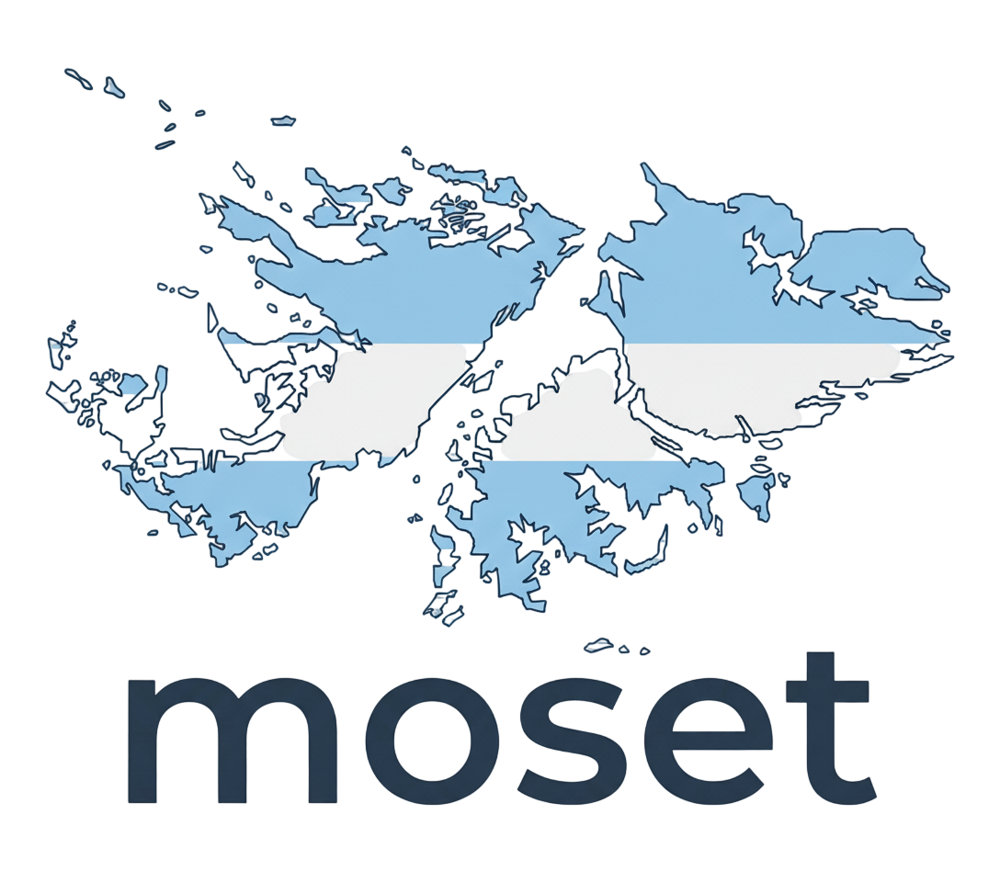

<div align="center">
  
  
  # Moset Ecosystem
  **Sovereign Intelligence. Native Development.**

  [](https://github.com/narakastudio/moset/actions/workflows/moset-ci.yml)
  [](https://polyformproject.org/licenses/noncommercial/1.0.0)
  [](https://www.rust-lang.org/)
  [](https://tauri.app/)

  <br>
  <a href="https://www.paypal.com/donate/?hosted_button_id=SJEV4XPZGFNP6">
    
  </a>
  <br>
  <i>Created and maintained by <b><a href="https://narakastudio.com">narakastudio.com</a></b></i>
</div>

<br/>

**Moset** (from Selk'nam: *"Sovereignty"*) is much more than a framework; it is a complete ecosystem for developing local, private, and high-performance Artificial Intelligence. Developed by **Naraka Studio**, Moset combines the spotless power of **Rust** with the visual flexibility of **Tauri** and **React**, creating a revolutionary IDE that runs native AI without relying on the cloud.

---

## 🌐 Vision and Architecture

To fully dive into the philosophy, technical foundations, and the "Lore" behind this project, we invite you to read our central documentation:

📖 **[Read The Moset Bible (ES)](./Biblia_Moset.md)**
📖 **[Read The Moset Bible (EN)](./Biblia_Moset_en.md)**

## ✨ Key Features

- **Absolute Privacy**: AI models run directly on your hardware, offline.
- **Native Performance**: core-engine backend completely written in pure Rust.
- **Cross-Platform**: Proven compatibility on Windows, macOS, and Linux. Optional CUDA support.
- **Glassmorphism Frontend**: Immersive and cutting-edge IDE under Naraka IDE.
- **Moset-Lang (.et)**: A custom programming language with U-AST, omnilingual keywords (Spanish, English, and more), quantum variables, and elastic molds.
- **MosetOutputPanel**: Premium visual panel for .et script execution results (quantum bars, mold cards, glassmorphism).
- **Universal Orchestrator (Roadmap)**: Moset is designed to become a polyglot orchestrator — executing Python, Node.js, Java and more from within a single .et file.

## 📁 Repository Structure

```text
/moset-ecosystem
 ├── core-engine/         # Pure Rust backend: Lexer, Parser, Compiler, VM, AI
 ├── naraka-ide/          # Tauri + React IDE (MosetOutputPanel, ChatPanel, Explorer)
 ├── mos.et/              # Language Platform (semantic super-folder)
 │   ├── examples/            # 15 .et demo scripts (moldes, quantum, IA, etc.)
 │   ├── moset-lang/
 │   │   ├── idiomas_humanos/     # Human language dicts: es.toml, en.toml
 │   │   └── idiomas_computadora/ # Future: python.toml, js.toml connectors
 │   └── orquestadores/       # Future: Vercel/Node/Python web bridges
 ├── scripts/             # Fine-tuning, corpus generation, CLI installer
 └── ai-corpus/           # Training data for Moset-specific models
/logos moset/             # Visual Identity and branding
```

## ⚙️ Installation & Basic Build

### Requirements
- **Rust** and **Cargo**
- **Node.js** and **npm** (for Tauri)

### Running the Development Environment (IDE)

```bash
cd moset-ecosystem/naraka-ide
npm install
npm run tauri dev
```

### Running a .et script (CLI)

```bash
moset run archivo.et
```

> **Note:** The heavy model downloads (.safetensors, .gguf) are configured using the integrated scripts, which are ignored by native version control due to their large file size.

---
<div align="center">
  <i>Moset 2026 - Developed by <b>narakastudio.com</b></i>
</div>
